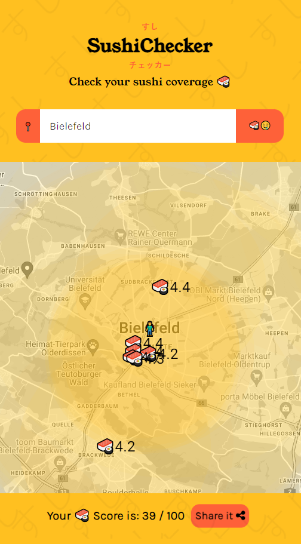

# 🍣 Sushi Coverage Map 🗺️

## Welcome, Sushi Lovers! 🍣

Are you a sushi enthusiast with an insatiable appetite for adventure? Do you dream of exploring every nook and cranny of your city in search of the finest sushi joints? Well, look no further! Welcome to the Sushi Coverage Map, a project that combines your love for sushi with cutting-edge technology! 🍣🌍

[**Try it now**](https://sushi-coverage-check.web.app/)

<table style="width: 100%;">
  <tr>
    <td style="width: 40%; text-align: center;">
      
    </td>
    <td style="width: 60%;">
        <h2>🛸 What is this Magical Sushi Map?</h2>
        Our Sushi Coverage Map is like Google Maps, but specifically designed to help you navigate the sushi scene in your city. Powered by Angular and Firebase, this map will make your sushi quests more enjoyable than ever before. 
    </td>
  </tr>
</table>


## 🌟 Features That Will Blow Your Mind

- 🗺️ **Interactive Map**: Explore your city's sushi joints with an easy-to-use map interface. Zoom in, zoom out, and let your cravings guide you.
- 🍣 **Sushi Spot Locator**: Find sushi restaurants near you in a flash. Never go hungry again!
- ⭐ **Ratings & Reviews**: See what others think about the sushi spots. Trust the sushi community's judgment.

## 🚀 Getting Started

1. **Clone this Repository**: Start by cloning this repository to your local machine. Use `git clone` and the repository URL.

2. **Install Dependencies**: Navigate to the project directory and run `npm install` to install all the necessary dependencies.

3. **Firebase Configuration**: Set up your Firebase project and obtain the configuration details. Replace them in the `environment.ts` file.

4. **Angular CLI**: Make sure you have Angular CLI installed. If not, run `npm install -g @angular/cli`.

5. **Run the App**: Use `ng serve` to run the app locally. Access it at `http://localhost:4200/`.

## 🤖 Contribute

We welcome sushi enthusiasts and tech-savvy ninjas to contribute to this project. Whether you want to add new features, fix bugs, or suggest improvements, your help is much appreciated. Let's roll together!

## 🍣 Sushi Credits

This project wouldn't be possible without the endless support of sushi chefs, sushi lovers, and the Angular and Firebase communities. 🙏

## 🍱 Grab Your Chopsticks!

Don't wait any longer to embark on your sushi adventure. Clone this repo, find your favorite sushi spots, and let's sushi-roll! 🍣🍣🍣

### 🍣🍣🍣 Happy Sushi Hunting! 🍣🍣🍣

Disclaimer: This project may cause intense cravings for sushi and a strong desire to explore every sushi place in town. Please sushi responsibly! 😄

Certainly! Here's a section on how to set up the Google JSON API, Google Geocoding API, and Google Places API for your Sushi Coverage Map project:

---

## 🌐 Setting Up Google APIs

To power the location and mapping features of our Sushi Coverage Map, we rely on Google APIs, including the Google JSON API, Google Geocoding API, and Google Places API. Follow the steps below to set up these APIs for your project:

### 1. **Create a Google Cloud Project**

First, you need to create a Google Cloud project to manage your APIs and billing. Here's how:

- Go to the [Google Cloud Console](https://console.cloud.google.com/).
- Click on the project dropdown and select "New Project."
- Give your project a name and click "Create."

### 2. **Enable APIs**

Once you have a project, you need to enable the required APIs:

#### a. Google Maps JavaScript API (for map rendering)

- In the Google Cloud Console, navigate to the "APIs & Services" > "Library" section.
- Search for "Google Maps JavaScript API" and click on it.
- Click the "Enable" button.

#### b. Google Geocoding API (for converting addresses to coordinates)

- In the Google Cloud Console, navigate to the "APIs & Services" > "Library" section.
- Search for "Google Geocoding API" and click on it.
- Click the "Enable" button.

#### c. Google Places API (for retrieving place details)

- In the Google Cloud Console, navigate to the "APIs & Services" > "Library" section.
- Search for "Google Places API" and click on it.
- Click the "Enable" button.

### 3. **Create API Credentials**

To access these APIs, you'll need to create API credentials. Here's how:

- In the Google Cloud Console, navigate to the "APIs & Services" > "Credentials" section.
- Click the "Create Credentials" button and select "API Key."
- Your API key will be generated. Keep it secure!

### 4. **Restrict API Key (Optional)**

For added security, you can restrict the usage of your API key. You can set restrictions based on IP addresses, HTTP referrers, and more. To restrict your API key:

- In the Google Cloud Console, go to the "APIs & Services" > "Credentials" section.
- Click on your API key to edit its settings.
- Under "Application restrictions," configure the restrictions as needed.

### 5. **Add API Key to Your Angular App**

In your Angular project, you'll need to add your Firebase config to the relevant configuration file. This is the `environment.ts` file.

Also copy the .envCopy and change the values as needed:

```typescript
MAP_API_KEY=MapsKey
```

Lastly please update the 

```typescript
MAP_API_KEY=MapsKey
```

## Setting the "suhshiapp.mapsserverkey" Secret

To set the "suhshiapp.mapsserverkey" secret in your Firebase project, follow these steps:

1. **Firebase CLI Installation:**

   If you haven't already, make sure you have the Firebase CLI installed. You can install it globally using npm (Node.js package manager) with the following command:

   ```bash
   npm install -g firebase-tools
   ```

2. **Login to Firebase:**

   If you're not already logged in to your Firebase account, use the following command to log in:

   ```bash
   firebase login
   ```

3. **Set the Secret:**

   Use the Firebase CLI to set the "suhshiapp.mapsserverkey" secret. Replace `"YOUR_MAPS_SERVER_KEY"` with your actual Google Maps API server key:

   ```bash
   firebase functions:config:set suhshiapp.mapsserverkey="YOUR_MAPS_SERVER_KEY"
   ```

4. **Deploy Your Firebase Functions:**

   To make the secret available to your Firebase Cloud Functions, you need to redeploy them:

   ```bash
   firebase deploy --only functions
   ```

Now, you've successfully set and accessed the "suhshiapp.mapsserverkey" secret in your Firebase project.

---

Feel free to customize this README section to fit your project's specific needs, and make sure to replace "YOUR_MAPS_SERVER_KEY" with the actual server key you want to set as the secret.

### 6. **Usage in Your Project**

Now that you've set up your API keys, you can start using the Google APIs in your Angular app. Import the necessary libraries, and you're all set to integrate maps, geocoding, and places functionality into your Sushi Coverage Map!

Remember to monitor your API usage and billing in the [Google Cloud Console](https://console.cloud.google.com/).

With these APIs in place, your Sushi Coverage Map will be able to display maps, geocode addresses, and provide rich place information to enhance the sushi-hunting experience for your users.

Happy mapping and sushi hunting! 🍣🗺️